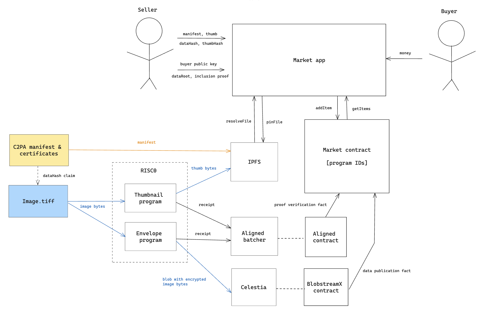

# Stock Zero

Trust-minimized marketplace for content creators.

This is a PoC developed during the [Lambda Hack '24](https://dorahacks.io/hackathon/lambdahackweek2).  
It utilizes cryptographic techniques to remove trust from transactional relations between content creators and acquirers.

### Fake content and C2PA standard

Fake content is a huge problem which is already pretty severe but it's nothing compared to what expects us in the future. Luckily, there are initiatives like [Coalition for Content Provenance and Authenticity](https://c2pa.org/) (C2PA) that provide tooling to navigate through the AI-generated content, fakes, forgeries, and enforce integrity.

In a nutshell, now every piece of media has a special manifest with a set of claims about that piece plus a chain of certificates attesting these claims. It can be something simple as data hash or more involved info like 3D depth or geo-location in the moment of taking the shot. Ultimately if you trust the root authority and the hardware/software that creates attestations you can be sure that the piece of media is untampered and possesses certain properties.

### Proof of content transformation

Signed content is great, but what if we want to make some modifications? Well C2PA standard allows to issue additional claims for every subsequent change (e.g. made by Adobe Photoshop) assuming that the licensed software would attest them. However, this is not really a reliable approach, and we can do better!

Here ZKPs enter the game and offer provable content transformation, i.e. you can think of it as another type of claim where the attestation is not a certificate but a zero-knowledge proof. This is pretty powerful mechanism because not only it allows to preserve the chain of modifications, but it is not possible to hide certain intermediate states without losing the ability to prove claims about the original.

### Proof of exclusive publication

Unrelated but important technique that will be very handy for our purposes is a verifiable non-interactive way to deliver content to the buyer. It combines envelope encryption, ZKPs, and data availability solutions to make sure that pre-committed data made available for downloading without revealing it to the wide public.

## Photo marketplace as a real use case

To narrow down the scope and to demonstrate the possibilites of the tech we decided to take a real world scenario where all parties would benefit greatly from removing the need of trust.  

Here is the case: fashion photographers do shootings and then sell them to magazines. It is pretty common case when magazines do not pay or abuse photographers in other way. Although there is a risk of fraud from both parties, overall the situation is quite assymetrical.  

Let's outline the risks and how we can reduce them with the forementioned techniques:
- The pictures are generated using AI or stolen: here is where C2PA comes handy
- Let's say the certificates are fine, but the previews (watermarked) provided to the magazine do not match the original: provable transformation solves this
- Finally, if magazine pays first there is a chance that photographer won't send the originals (similarly if the magazine pays afterwards it can choose not to pay at all): here we need a decentralized escrow (smart contract) + proof of exclusive publication to claim the funds

Putting everything together we now have a solution that reduces the need of trust between transacting parties and the need of trusted arbitrage. The only assumption is PKI and hardware/software attestation security.

## Implementation details

### Create new item

First step is listing a new item for sale, in order to do that the content creator has to do some preliminary work:
0. Obtain C2PA manifest for their content
1. Create a thumbnail and a proof that it was actually derived from the original
2. Submit the proof to Aligned and wait till the verification

After that it's possible to create a new item by interacting with the marketplace contract. Creator has to provide:
- Sell price
- C2PA manifest
- Verification data (from Aligned)
- Thumbnail image

The contract will check that the proof is correct and that public output contains the same thumbnail image hash. Thumbnail is uploaded to IPFS so the app uses thumbnail hash for content resolving actually.

The manifest is verified on the client side: it is not absolutely necessary to generate a ZKP for that.

### Purchase item

The item is displayed in the listing and anyone can purchase it: money will be locked on the contract and it will await proofs of delivery, i.e. that the original content can be downloaded by the buyer.

### Deliver item

Once the money are deposited, the seller again has to do several preliminary actions:
1. Encrypt the original image using public key of the buyer and random session key
2. Submit blob to Celestia and store the header of the block containing the blob
3. Produce range proof for shares the blob consists of
4. Run RISC0 program (or multiple programs) that does the encryption and inclusion proof verification
5. Submit the proof(s) to Aligned and wait till the verification
6. Obtain Blobstream attestation proof for the block that contains the blob

After it's done, seller can redeem the payment. It has to invoke the marketplace contract with the following data:
- Public key that was used for encryption
- Verification data (from Aligned)
- Attestation proof

The contract will check that the proof is correct and that public output contains the same image hash, public key, also that public key actually matches the buyer's account address. If everything is ok, the payment is unlocked, deal is settled.

## Step-by-step guide

### Installation

Risc0 toolchain
https://dev.risczero.com/api/zkvm/install 

C2PA utilities
https://github.com/contentauth/c2patool?tab=readme-ov-file#building-from-source

Aligned batcher CLI
https://docs.alignedlayer.com/introduction/1_getting_started

Celestia light node
https://docs.celestia.org/developers/node-tutorial

Instructions for [RISC0 programs](./programs)  
Instructions for [Marketplace app](./app)

### Usage

The usage flow includes interacting with multiple systems and it is mostly manual work :)  
Nevertheless, individual parts work, though the integration might be broken if misconfigured.

#### Create external C2PA manifest

For testing purposes we need to [create self-signed certificates](./c2pa/README.md) for the original images.

#### Generate thumbnail

Go to programs and run:
`make thumbnail-proof`

#### Submit proof to Aligned

Go to programs and run:
`make aligned-submit-thumbnail`

The verification data should be available at `~/.aligned/aligned_verification_data/<file.json>`.  
We will need it at later stages.

#### Create market item

Go to the browser and open the item creation form.  
Fill the fields with the data generated on the previos steps:
- C2PA manifest
- Verification data
- Thumbnail (produced by the RISC0 program)

#### Deposit funds

Now play the buyer role and press purchase on the listed item. 

#### Create encrypted blob

Run the envelope program (in dev mode) to produce the blob.

#### Submit blob to Celestia and get range proof

Follow the [instructions](./submit-blob/README.md) to submit the blob to Celestia testnet and generate proof.  
Note that you might be required to do some extra configuration.

#### Verify inclusion proof

Run delivery program to produce the blob inclusion proof.

#### Submit proof to Aligned

Go to programs and run:
`make aligned-submit-delivery`

The verification data should be available at `~/.aligned/aligned_verification_data/<file.json>`.  
We will need it in the next step.

#### Finalize the trade

Go to the browser and fill the "submit proof" form with the data obtained in the previous steps.  
If everything works fine, you will get the money!

## Limitations

### C2PA / self-signed external manifest

Currently there's no tooling that would allow to verify external c2pa files, you can only check an image with embedded manifest/certificates. Hence for now we do not do that check on the client.

### Risc0 / proving time

The goal was to be able to generate proof locally and to be able to stay wthin minutes (below 10-20M cycles on M3 machine) we can only operate with uncompressed formats (e.g. TIFF) and small pictures (less than 50KB).

### Aligned / proof facts and public outputs

Aligned provides you all the data you need to do onchain verification, but it's complicated to check public output constraints because of how encoding is currently implemented. More specifically, verification data contains hash of Risc0 receipt which in its turn contains seal (large proof) and journal (public outputs). If you want to check that particular output equals to some value you would need to provide both the journal and the seal which is not feasible to do in Ethereum (seal is typically megabytes). 

### Blobstream / blob inclusion proof

Currently the blobstream contract allows you to check attestation proofs (that a particular data root is part of the chain) and share proofs (that a particular range of shares are part of the tree which root is attested), but not blob inclusion proofs. The idea is that you do that in your own circuit and then just verify that data root and blob commitment match the public outputs.

A potential problem with this approach is that you can only generate ZKP after you submit your blob to Celestia, because you have to know which block contains your blob and what is the position of your blob within that blob. That creates extra friction since it's quite different to collect all the necessary data to feed the circuit.

## Related work

* [Pixel Police](https://devfolio.co/projects/pixel-police-a4c5) - A protocol that enables organisations to verify that digital content(image or video) is not GenAI/ Deepfake 
* [Veritas](https://eprint.iacr.org/2024/1066) - Verifying Image Transformations at Scale
